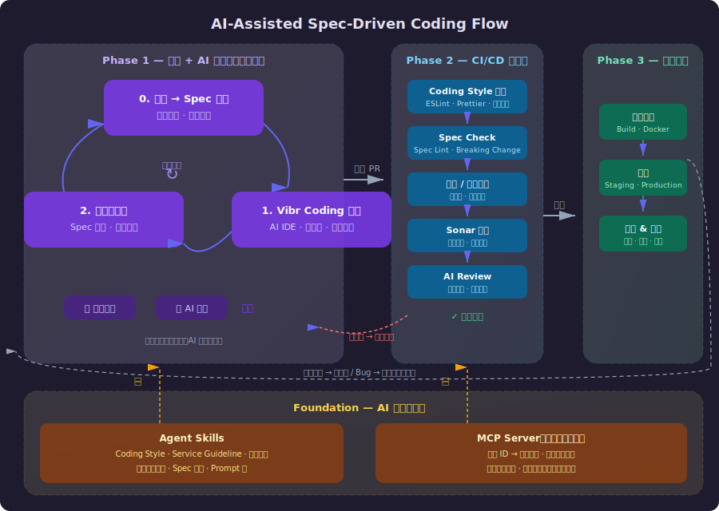

## 前提与目标

- **工具前提**：团队统一使用带 LLM 能力的 IDE（如 Cursor、VS Code + Claude Code），并接入先进大模型。
- **责任前提**：**开发人员是责任人**，AI 只作为高效的"实习生 + 助理"，不能替代人的判断与签字。
- **治理前提**：必须有一套可复用的 **规范流程 + 工具支持 + 检验标准**，而不是"随缘用 AI"。

目标：

- **统一工作方式**：让人类开发者与 AI 在"以 Spec 为中心"的模式下高效协同。
- **安全提效**：充分利用 AI 生成/分析能力，但保持可控、可审计。
- **可演进**：随着模型与工具升级，流程本身可以演进，但核心责任和边界稳定。
- **可验证、可追溯**：任何交付物都能追溯到明确的需求与 Spec，并可通过自动/半自动手段验证。

---

## 整体架构

整个流程分为 **三个阶段** 和 **一个基座层**：

| 层级 | 名称 | 核心职责 |
| ------ | ------ | ---------- |
| Phase 1 | 研发 + AI 协作（循环迭代） | 需求→Spec→实现→测试，开发人员与 AI 在 IDE 中循环推进 |
| Phase 2 | CI/CD 质量门 | 提交 PR 后自动执行 Coding Style、Spec Check、测试、Sonar、AI Review |
| Phase 3 | 发布上线 | 构建打包 → 部署 → 监控 & 回滚 |
| Foundation | AI 基础能力层 | Agent Skills（规范/知识/模板）+ MCP Server（外部系统集成） |

Phase 1 内部是一个 **循环迭代** 的闭环（Spec 起草 → Vibr Coding → 测试验证 → 回到 Spec），开发者可以在 AI 辅助下多轮打磨，直到认为可以提交 PR。Phase 2 是自动化的质量关卡，未通过则打回 Phase 1 修改。Phase 3 在所有门槛通过后执行发布，线上反馈再回到 Phase 1 形成大循环。

Foundation 层为 Phase 1 和 Phase 2 提供底层能力支撑。

---

## Foundation — AI 基础能力层

这一层是整个流程能够"AI 化"的前提，为 Phase 1 的研发协作和 Phase 2 的自动化审查提供知识与集成能力。

### Agent Skills（AI 可调用的知识与规范）

- **Coding Style**：语言级别的编码规范、命名约定、代码组织风格，以 Skill/Prompt 形式内化到 AI 的行为中。
- **Service Guideline**：服务架构约束（分层结构、错误处理模式、日志规范等），让 AI 生成的代码自动符合团队架构。
- **业务领域知识**：核心业务概念、领域术语、业务规则摘要，帮助 AI 理解上下文而非只做语法变换。
- **Spec 模板 & Prompt 库**：标准化的 Spec 模板、常用指令（如 `/spec-diff-review`, `/gen-tests-from-spec`），降低协作摩擦。

### MCP Server（外部系统集成）

- **需求拉取**：通过需求 ID 从项目管理平台（如 Jira、飞书项目等）拉取需求详情、验收标准、关联设计稿。
- **设计资源获取**：拉取 UI 设计稿、API 设计文档等关联资源，作为 Spec 起草和实现的输入。
- **状态同步**：在关键节点（Spec 完成、PR 提交、测试通过、发布上线）自动更新需求状态，保持项目管理平台与实际进度一致。

---

## Phase 1 — 研发 + AI 协作（循环迭代）

Phase 1 是开发者日常工作的主战场。以下三个步骤构成一个 **循环**：在 AI 辅助下反复打磨，直到满足提交 PR 的质量标准。

### 0. 需求输入与 Spec 起草

**目标**：把需求和场景沉淀为可执行的行为规范（Spec），成为后续所有工作的单一事实来源。

- **输入**：业务需求、用户故事、现有系统的改造诉求。可通过 MCP Server 直接用需求 ID 拉取详情和设计资源。
- **AI 辅助**：
  - 在 IDE / Chat 中，让 LLM 把口语化需求结构化为：
    - 业务目标
    - 约束与边界（数据范围、性能、安全、合规等）
    - 关键场景（成功 / 失败 / 异常）
  - 让 AI 给出几个"容易忽略的边界情况"，作为后续 Spec 和测试的候选。
- **Spec 起草**：
  - 在 `specs/` 目录下，为域/服务创建或更新 `*.spec.(yaml|md)`：
    - 接口签名：路径、方法、请求/响应模型。
    - 领域约束：必填字段、取值范围、状态机与不变量。
    - 错误空间：错误码、含义、触发条件。
    - 关键用例：Given-When-Then 风格的成功/失败/异常场景。
  - AI 根据自然语言需求 + 历史规范 + Agent Skills 中的模板，生成规范初稿。
- **控制点**：
  - 每个 Spec 文件纳入 **git 管理**，与代码一起提交。
  - 开发者本人对 Spec 正确性负责。日常小变更可自审通过，复杂/跨团队变更走多人评审。
- **责任人**：**人类开发者 / 领域责任人** 对"需求版真相"负责，AI 的输出只是材料。

### 1. Vibr Coding 实现

**目标**：在 IDE 中用 AI 高效生成和改写代码，但所有关键决策和签字由人负责。

- **输入**：已完成的规范版本（来自 `specs/`）。
- **活动**：
  - 从 Spec 生成基础工件（可以通过工具或脚本）：
    - 类型定义 / DTO / client stub / handler skeleton。
    - 基础测试骨架（按场景列出空用例）。
  - 在 IDE 中使用 LLM 完成实现，约束：
    - 提示中显式引用对应的 Spec 文件，例如：
      - "严格按 `specs/order.spec.yaml` 的接口签名和错误码实现 handler。"
    - 对领域核心逻辑，优先采用 **函数式风格**：
      - 把业务规则实现为纯函数。
      - 副作用集中在适配层（I/O、DB 调用、网络请求）。
  - 对每一个重要 Spec 条目，都要求：
    - 有对应的实现入口（函数 / handler 等）。
    - 有至少 1 条对应的测试用例（单测或集成）。
- **责任划分**：
  - AI 可以完成大部分样板 & 初稿，但：
    - 开发者必须亲自过一遍关键路径（数据流、状态变更、边界条件）。
    - 禁止"盲信生成结果"，尤其是安全、权限、金流相关逻辑。

### 2. 测试与验证

**目标**：测试设计与实现都以 Spec 为准，而不是随手测或只看代码行覆盖。

- **输入**：规范文件 + 实现代码。
- **活动**：
  - 由开发人员基于 Spec **主导设计测试用例**：
    - 覆盖核心和边界场景，既包括单元测试（函数/模块级），也包括功能/集成测试（接口级）。
  - 使用 LLM 作为辅助：
    - 帮忙扩展用例列表，补充容易遗漏的变体。
    - 生成测试代码初稿，由开发者收紧断言、校正业务细节。
  - 对外部依赖（上下游服务）采用基于 Spec 的合同测试（contract testing）：
    - Provider/Consumer 双方共同认可同一份 Spec。
    - 使用工具自动检查实现是否符合合同。

> 在 Phase 1 的循环中，如果测试发现问题，可以直接回到 Spec 修正或回到 Coding 修改实现，不需要走 PR 流程。只有当开发者认为 Spec、实现、测试三者一致后，才提交 PR 进入 Phase 2。

---

## Phase 2 — CI/CD 质量门

**目标**：提交 PR 后，由自动化流水线执行"最小安全要求"，避免完全依赖个人自觉。

PR 提交后，流水线自动串联以下检查：

| 检查项 | 内容 |
| -------- | ------ |
| **Coding Style 检查** | ESLint / Prettier / 团队风格规范 |
| **Spec Check** | 规范 lint / schema 校验 / breaking change 检测 |
| **单元 / 集成测试** | 覆盖率校验、合同测试 |
| **Sonar 评分** | 代码质量、安全扫描、技术债务 |
| **AI Review** | 语义层面审查：Spec ↔ 实现一致性、高风险区域标记、建议行动项 |

- **AI Review 细节**：
  - 后台 AI Agents 基于 Agent Skills 中的规范和架构约束自动审查。
  - 生成结构化报告：摘要结论、关键发现清单、建议行动项。
- **未通过处理**：任一检查未通过，PR 标红，打回 Phase 1 修改。
- **合并决策**：
  - 默认可主要依赖 AI 报告 + CI 结果做合并决策。
  - 高风险变更（安全、金流、跨服务）、AI 标记"高不确定性"的项、新人/新模块早期阶段需人工 Review。
  - 无论是否有人工 Review，**合并责任仍在人类开发者/Owner**。
- **状态同步**：通过 MCP Server 在 PR 合并后自动更新需求状态。

---

## Phase 3 — 发布上线

**目标**：所有质量门通过后，安全地将变更交付到生产环境。

- **构建打包**：Build、Docker 镜像构建、制品归档。
- **部署**：按环境分级（Staging → Production），支持灰度发布。
- **监控 & 回滚**：
  - 上线后持续监控告警。
  - 出现异常时可快速回滚。
  - 线上反馈（Bug、性能问题、新需求）回到 Phase 1，开启下一轮迭代。

---

## 变更管理与演进

**目标**：在有大模型持续升级的背景下，规范、实现和测试都能可控演进。

- **规范版本管理**：
  - 使用 SemVer 给 Spec 打版本号。
  - CI 对接口变更做类型级别的 diff，辅助判定是否为 breaking change。
- **AI 在变更中的角色**：
  - 根据 Spec diff 自动生成：
    - 影响分析（受影响的服务、客户端、业务流程）。
    - 更新文档、示例和迁移指南草稿。
  - 帮忙识别"潜在未更新"的调用方（例如通过代码搜索 + 语义分析）。
- **人类责任**：
  - 在评审会上回答"为什么要改"，AI 主要说明"改了什么、可能影响谁"。

---

## 后续讨论方向

- **方向 1**：细化 Spec 起草的操作细则和示例（包括一个完整的 Spec 样例）。
- **方向 2**：定义 Vibr Coding 的"函数式风格"在本团队内的最小约束集。
- **方向 3**：把 Agent Skills 和 MCP Server 的具体配置方案落地（包括 Skill 清单、MCP 接口定义）。
- **方向 4**：把 AI 使用模式写成可引用的 Prompt/Skill/Plugin 配置，减少口头约定。
