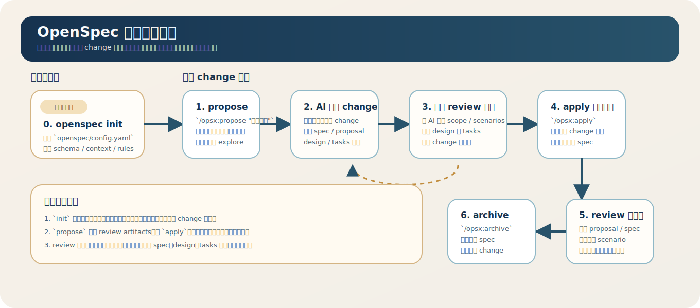

本文用于约束开发团队如何使用 OpenSpec 管理需求、实现和归档。它不是工具操作手册，而是一套团队协作规范：什么情况下必须建 spec，spec 写到什么程度，开发过程中如何保持 spec 与代码一致，以及遇到异常情况时如何处理。

---

## 1. OpenSpec 简介

### 1.1 OpenSpec 是什么

OpenSpec 可以理解为一种“以变更为中心”的研发协作方式：

- `specs/` 描述系统当前已经成立的行为，是当前事实。
- `changes/` 描述正在发生的变更，是未来事实。
- 开发不是直接改代码，而是先定义“行为要变成什么”，再实现，再归档为新的事实。

对团队来说，OpenSpec 的价值不在于多了一套目录，而在于把下面三件事绑定在一起：

- 需求边界
- 代码实现
- 变更历史

### 1.2 核心概念

| 概念 | 团队视角下的含义 |
| ---- | ---------------- |
| **Spec** | 系统行为说明，回答“系统应该做什么”。它不讨论类、函数、框架等实现细节。 |
| **Change** | 一次独立变更单元，通常对应一个需求、一个缺陷修复或一个明确的重构目标。 |
| **Delta Spec** | 对现有系统行为的增量描述，只写本次 change 改变了什么。 |
| **Proposal** | 说明为什么要做、要做到什么程度、不做什么。 |
| **Design** | 说明怎么实现，以及为什么这样实现。 |
| **Tasks** | 可执行的落地清单，回答“接下来具体做什么”。 |
| **Archive** | 变更完成后归档，保留审计和回溯能力。 |

### 1.3 推荐目录结构

```text
openspec/
├── config.yaml           # OpenSpec 项目级配置
├── specs/                # 当前生效的系统行为
└── changes/              # 正在进行中的变更
    ├── <change-name>/
    │   ├── proposal.md
    │   ├── design.md
    │   ├── tasks.md
    │   └── specs/
    └── archive/          # 已归档的历史变更
```

### 1.4 团队对 OpenSpec 的基本约束

- 任何会改变外部可观察行为的工作，都应先进入 OpenSpec。
- spec 是团队共享语言，不是写给某一个 AI 或某一个开发者看的临时说明。
- `specs/` 只记录“当前成立的行为”，不保留讨论痕迹；讨论和权衡放在 `changes/` 中。
- 如果代码与 spec 不一致，以 spec 为准；如果 spec 错了，应先修 spec，再继续实现。

### 1.5 初始化要求：先 `openspec init`

根据 OpenSpec 官方 `customization.md`，`openspec init` 的重点是交互式创建项目级配置文件 `openspec/config.yaml`，用于定制 OpenSpec 的默认行为。

```bash
openspec init
```

因此，团队对 `init` 的理解应是：

- 它是“项目接入 OpenSpec”的初始化步骤
- 它的核心产物是 `openspec/config.yaml`
- 它用于固化项目级的默认 schema、context 和 rules
- 它不是每次 change 都要重新执行的日常步骤

如果仓库还没有完成 `init`，建议不要直接开始 `propose`，因为 AI 会缺少项目级约束。

### 1.6 `openspec/config.yaml` 配置规范

按官方文档，`openspec/config.yaml` 主要负责三件事：

- 指定默认 `schema`
- 提供项目级 `context`
- 为不同 artifact 定义 `rules`

团队规范应围绕这三块来设计，而不是随意扩展一套自定义字段。

一个最小可用示意如下：

```yaml
schema: spec-driven

context: |
  Tech stack: TypeScript, Next.js, Node.js
  Package manager: pnpm
  Testing: Vitest and Playwright
  Follow company engineering rules in docs/team-engineering-rules.md
  Before drafting frontend-related changes, read .codex/skills/frontend/SKILL.md
  Before drafting test strategy, read .codex/skills/testing/SKILL.md

rules:
  proposal:
    - Include rollback plan
    - Identify affected teams
  specs:
    - Use Given/When/Then format
    - Cover permission and failure scenarios
  design:
    - Reference existing patterns before inventing new ones
  tasks:
    - Add explicit test tasks for behavior changes
```

### 1.6.1 `schema` 规范

- 默认应使用团队认可的 schema，避免每次命令都手动指定
- 如果团队采用官方标准流程，优先使用默认的 `spec-driven`
- 只有当团队流程明显不同于标准 artifacts 结构时，才考虑自定义 schema

### 1.6.2 `context` 规范

`context` 会注入所有 artifact 生成过程，因此这里只放“所有 change 默认都应知道的信息”。推荐包括：

- 技术栈与核心框架
- 包管理、构建和测试工具
- API 契约位置或接口风格
- 公司代码规范入口
- 兼容性、安全性、性能等长期约束
- AI 在特定场景下应优先读取的 skills 或内部文档

如果团队希望 AI 自动参考 skills，更稳妥的做法是在 `context` 中明确写出“什么场景下应读取哪个 skill”，而不是再发明一套平行配置。

### 1.6.3 `rules` 规范

`rules` 应写成可执行的 artifact 约束。推荐至少覆盖：

- `proposal`：范围、风险、影响面、回滚方案
- `specs`：Given/When/Then、主路径、失败路径、权限边界
- `design`：关键权衡、兼容性影响、迁移方案
- `tasks`：实现步骤、验证步骤、测试任务

规则应尽量具体，例如：

- Include rollback plan
- Cover permission and failure scenarios
- Add explicit test tasks for behavior changes

不要只写：

- Follow best practices
- Keep high quality

这类表述无法稳定约束输出。

### 1.7 什么时候需要自定义 schema

官方支持自定义 schema，但团队不应一开始就走这条路。更合理的顺序是：

```text
先运行 openspec init
→ 在 config.yaml 中固化 schema / context / rules
→ 只有当标准 spec-driven 流程不适用时，再自定义 schema
```

通常只有在下面几类情况才需要自定义 schema：

- 团队希望替换标准 artifacts 结构
- 团队需要新增或删除某类 artifact
- 团队需要定制模板或 artifact 之间的依赖关系

---

## 2. 常规使用流程

常规流程是团队默认路径，也是重点要求执行的部分。



项目首次接入 OpenSpec 时，先执行一次初始化：

```text
0. openspec init
```

初始化完成后，日常 change 建议统一按下面 6 步执行：

```text
1. /opsx:propose "简单需求"
2. AI 总结需求并生成 change
3. 开发 review 产出物并迭代到可开发
4. /opsx:apply 生成代码
5. review 并测试代码
6. /opsx:archive
```

### 2.1 什么时候必须走 OpenSpec

以下情况必须创建 change：

- 新增功能
- 修改现有业务规则
- 修复会改变系统行为的缺陷
- 跨模块重构，且行为边界需要被确认
- API、数据契约、权限、安全、计费等高风险变更

以下情况可以不单独创建 change，但仍建议补充记录：

- 纯文案修改
- 不影响行为的重构
- 明确无行为变化的小型内部优化

判断标准只有一个：外部可观察行为是否改变。如果会变，就进入 OpenSpec。

### 2.2 第一步：`/opsx:propose "简单需求"`

常规流程的起点不是先手写一堆文档，而是先给 AI 一个足够清楚、但不必过长的需求描述。

例如：

```text
/opsx:propose "支持团队管理员邀请成员加入组织"
/opsx:propose "修复订单超时后重复扣款的问题"
```

这里的“简单需求”不是指业务简单，而是指表达要聚焦，至少包含：

- 目标是什么
- 主要使用者或对象是谁
- 最关键的行为变化是什么

如果一句话还说不清楚，应该先探索/opsx:explore，不要直接 propose。

### 2.3 第二步：AI 总结需求并生成 change

`propose` 之后，AI 应负责把自然语言需求整理成一个完整的 change，并生成 change name。

每个 change 必须是一个独立的逻辑单元，命名使用 kebab-case，例如：

```text
add-member-invite
fix-order-timeout-retry
refine-billing-permission-check
```

命名要求：

- 体现业务意图，而不是技术动作
- 不使用 `misc`、`update`、`test-change`、`wip` 这类无意义名称
- 一个 change 不混入多个彼此独立的目标

AI 生成的常规产出应包括：

| 文件 | 是否必需 | 作用 |
| ---- | -------- | ---- |
| `proposal.md` | 必需 | 说明背景、目标、范围边界 |
| `specs/.../spec.md` | 必需 | 说明本次行为变更 |
| `tasks.md` | 必需 | 把工作拆成可执行步骤 |
| `design.md` | 常规建议生成 | 先给出默认设计方案，复杂场景再补充细化 |

团队要求的最低标准如下。AI 可以先生成初稿，但不能把初稿直接视为最终版本。

`proposal.md` 至少回答三件事：

- 为什么做
- 本次要交付什么
- 明确不做什么

`delta spec` 至少回答两件事：

- 哪些行为新增、修改或删除
- 每条 requirement 如何通过 scenario 被验证

`tasks.md` 至少回答两件事：

- 实现顺序
- 完成标志

### 2.4 第三步：开发 review 产出物，并和 AI 迭代到可开发

这一步是常规流程里的重点。`propose` 的价值不是“一次生成就完成”，而是让 AI 先产出一个足够完整的初稿，再由开发者进行 review，并和 AI 往返迭代，直到 change 可进入开发。

开发者在这一阶段要重点确认：

- `proposal.md` 没有明显歧义
- delta spec 已覆盖本次受影响的行为
- `tasks.md` 可以指导实现，而不是空泛待办
- `design.md` 的方案方向是否合理，是否遗漏关键约束

开发者与 AI 的典型迭代动作包括：

- 补充遗漏的 requirement 或 scenario
- 删除不属于本次范围的内容
- 调整 change name，让意图更准确
- 修正 design 中不符合现有架构的方案
- 重排 tasks，使其更符合实际开发顺序

如果以上条件不满足，不应直接开始实现。否则很容易出现“代码先跑起来，spec 事后补”的倒挂。

### 2.5 第四步：`/opsx:apply` 生成代码

当产出物已经被 review 到“可开发”状态后，再进入 `apply`。此时 AI 生成代码的依据应是已经确认过的 change，而不是最初那句自然语言需求。

开发阶段的工作原则：

- 代码实现必须能映射回 requirement 和 scenario
- 未在 spec 中定义的行为，不要在实现时自行扩展
- 发现 spec 不足时，先补 change，再继续写代码

推荐执行方式：

1. 先按 `tasks.md` 拆分实现顺序。
2. 每完成一块，就回看对应 scenario 是否已被满足。
3. 如实现方案偏离原设计，先更新 `design.md` 或 delta spec。

### 2.6 第五步：review 并测试代码

`apply` 之后，不能直接 archive。必须先做代码 review 和测试验证。

这一阶段至少包含两类动作：

- review 代码是否正确落实 proposal、spec、design、tasks
- 测试代码是否满足关键 scenario，且没有引入明显回归

这里的测试策略、覆盖范围、由谁来测，确实值得单独展开讨论；当前版本先把它作为强制步骤保留下来。

review 和测试的目标不是“代码能跑”就结束，而是确认以下三层一致性：

| 检查层 | 核心问题 |
| ------ | -------- |
| 完整性 | tasks 是否全部完成，是否有遗漏 requirement |
| 正确性 | 实现结果是否符合 scenario，而不是只满足开发者主观理解 |
| 一致性 | proposal、spec、design、代码、测试之间是否相互矛盾 |

团队至少应完成以下检查：

- requirement 是否都有对应实现
- 关键 scenario 是否有测试或可验证手段
- 代码中是否引入了 spec 没有定义的新行为
- `tasks.md` 是否已更新为真实完成状态

### 2.7 第六步：`/opsx:archive`

满足以下条件后才能 archive：

- 本次 change 的任务已完成
- 验证已通过，或遗留问题已明确记录
- delta spec 可以安全并入 `openspec/specs/`

archive 的本质不是“移动文件”，而是确认：

- 这次 change 已经成为系统当前事实
- 后续团队成员应从 `specs/` 理解当前行为
- 历史讨论保留在 archive 中，不污染当前事实

---

## 3. 非常规处理流程

非常规流程的目标不是绕过 OpenSpec，而是在现实开发过程中，给团队一个一致的纠偏方式。

### 3.1 需求未澄清，不能直接 propose

如果需求本身还不清楚，不要急着写 delta spec。先做一次探索，再形成 change。

探索阶段可以做的事：

- 阅读现有代码和已有 spec
- 列出问题边界和未决问题
- 输出候选方案与取舍

只有在“行为边界基本明确”后，才进入正式 change。

### 3.2 开发中发现 spec 写错了

这是最常见的非常规情况。处理原则：

- 不要让代码偷偷偏离 spec
- 先修正 change 中的 spec，再继续实现
- 若影响范围较大，应重新评审 proposal 和 tasks

简单说，正确顺序是：

```text
发现 spec 不准确
→ 更新 change 中的 artifacts
→ 重新确认范围
→ 继续开发
```

而不是：

```text
先把代码改对
→ 最后想起来再补 spec
```

### 3.3 范围扩大时如何处理

实现过程中如果发现“顺手做一下”会明显扩大范围，按下面规则判断：

| 情况 | 处理方式 |
| ---- | -------- |
| 仍然服务于同一个目标，只是细节调整 | 更新当前 change |
| 变成另一个独立目标 | 新建 change |
| 原 change 已接近完成，新内容属于下一轮迭代 | 先 archive 原 change，再开新 change |

团队不允许把多个独立目标堆在一个 change 里，否则会同时破坏评审、回溯和归档质量。

### 3.4 紧急修复如何处理

线上故障或高优先级缺陷允许先修复，但不能跳过补录。

推荐流程：

```text
先止血
→ 立即创建补录 change
→ 回填 proposal / delta spec / tasks
→ 验证实际修复行为
→ archive
```

这里的关键要求是“允许先修”，但“不允许不补”。

### 3.5 多个 change 并行修改同一 spec

并行开发时，最容易出现两个问题：

- 同一 requirement 被不同 change 重复修改
- A change 依赖 B change，但双方都按自己假设在推进

团队处理规则：

- 谁先 archive，谁先成为基线
- 后归档的 change 必须基于最新 `specs/` 重新检查 delta
- 发现冲突时，优先调整 change，而不是强行合并含糊描述

### 3.6 change 做废了怎么办

以下情况应主动终止或重建 change：

- 需求被取消
- 方案被证明不成立
- 原有 change 已经无法反映真实工作内容

处理方式：

- 若仅停止开发，可在 change 中记录终止原因，不 archive 到当前 spec
- 若已有部分内容仍有价值，拆分为新的、更小的 change

不要保留长期无人处理的“僵尸 change”。

---

## 4. Best Practices

### 4.1 先写行为，后写实现

最常见的问题是把 spec 写成设计文档。团队应强制区分：

- spec 说“系统应该表现成什么样”
- design 说“系统准备怎么做”

如果一条描述里出现数据库表名、类名、框架 API、消息队列主题名，它大概率不属于 spec。

### 4.2 一个 change 只解决一个问题

好的 change 应该满足：

- 可以独立理解
- 可以独立评审
- 可以独立上线或归档

如果一个 change 同时包含“新功能 + 重构 + 清理历史问题”，通常说明拆分粒度已经失控。

### 4.3 requirement 要可验证

不要写抽象空话，例如：

- 系统应有良好的性能
- 页面应更易用
- 接口应更稳定

更好的写法是写成可验证行为，例如：

- 当订单列表超过 1000 条时，系统必须支持按创建时间分页查询
- 当用户权限不足时，系统必须返回 403，而不是空结果

可验证，才可实现；可实现，才可归档。

### 4.4 scenario 覆盖关键路径即可，但不能漏边界

不是每个 requirement 都要写很多 scenario，但至少应覆盖：

- 主成功路径
- 关键失败路径
- 明显的权限、状态或输入边界

对于高风险变更，必须比日常变更多写一层异常路径。

### 4.5 tasks 要面向执行，不要面向汇报

好的 `tasks.md` 应该让开发者和 AI 都能直接执行，例如：

- 更新 invitation 创建接口与权限校验
- 补充 member invite 成功与重复邀请测试
- 更新后台邀请列表的状态展示

不好的任务写法通常是：

- 完成后端开发
- 优化逻辑
- 联调一下

### 4.6 评审时优先看边界，而不是优先看篇幅

团队评审 change 时，不要先问“文档写得多不多”，而要先问：

- 目标是否单一
- In scope / Out of scope 是否清晰
- requirement 是否可验证
- 是否定义了失败场景和边界条件
- 是否存在实现先行、spec 落后的迹象

### 4.7 archive 不是收尾动作，而是质量门

很多团队把 archive 当成机械操作，这会导致 `specs/` 很快失真。正确做法是把 archive 当成质量门：

- 没验证，不 archive
- 有已知偏差但未记录，不 archive
- 行为仍说不清楚，不 archive

只有可被后续团队成员直接信任的内容，才能进入 `specs/`。

### 4.8 团队落地建议

如果要把 OpenSpec 作为团队规范落地，建议至少统一以下约定：

- 什么类型的工作必须建 change
- `proposal.md`、delta spec、`tasks.md` 的最低质量标准
- 谁负责评审 change 进入开发
- 谁负责在合并前完成验证
- archive 的触发时机和责任人

如果这些约定不统一，OpenSpec 很容易退化成“有人写、有人不写、最后没人信”的形式主义。
